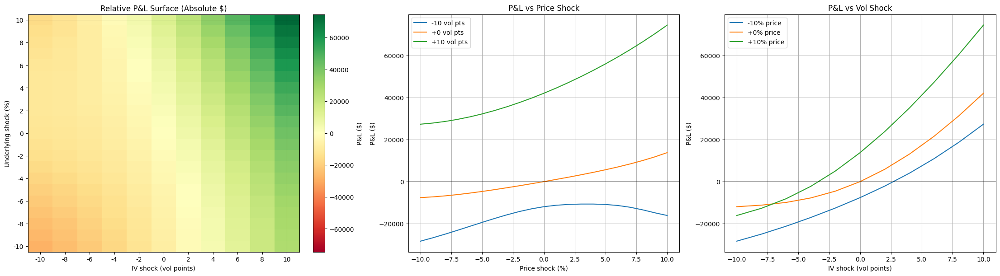

# Risk Manager

This tool helps keep tabs on the risk profile of a short/long options book. 

### Features 
- Outputs net vega and theta normalized for contract size 
- Sorts portfolio into short and long book assuming short book is < 40 DTE and long book is > 90 DTE 
- Test a range of price and vol shock scenarios with estimated P&L curves 

